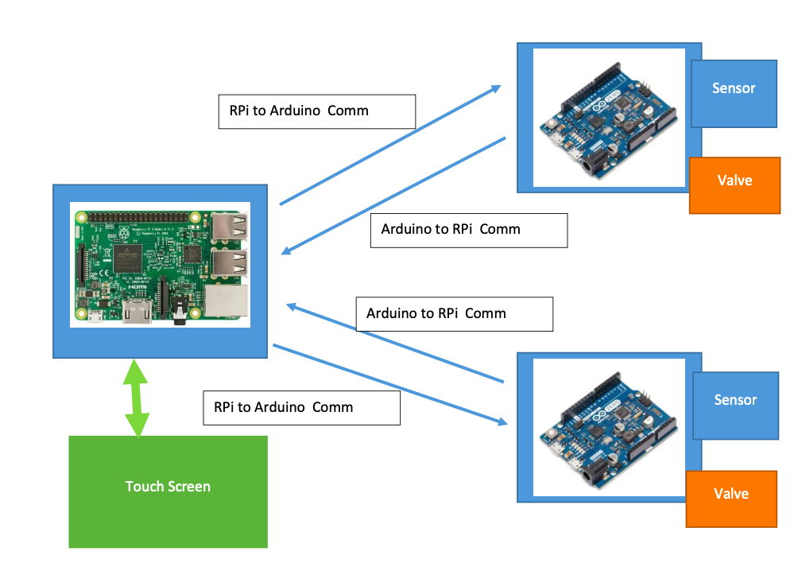
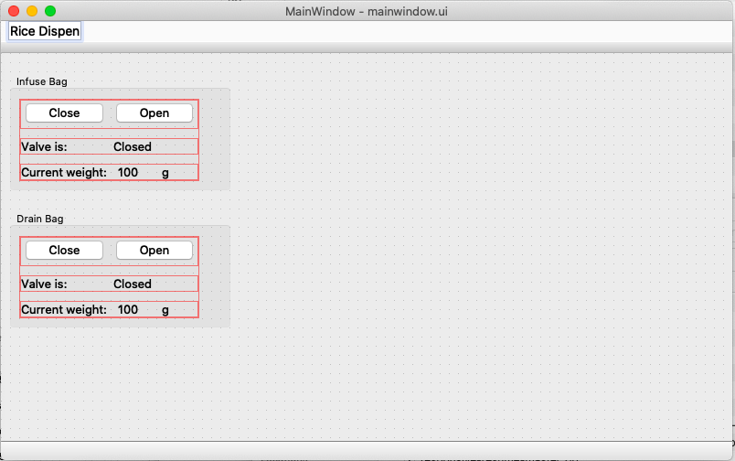

# Two channel Valve Controller

This is 2-channel valve controller interface with touchscreen input, which can be use in various industrial automation purpose, such as Rice dispenser, Chemical chambers etc.

We can use one valve at the Infuse bag and other valve ar the drain bag so we can control the flow into and out of the chamber.

## Working

The system uses Raspberry pi based controller unit with a touchscreen HMI.

The front end of the HMI is made using QT widget.

Two seperate real-time controllers(Arduino uno) used to control the opening and closing of valve motors based on the input from raspberry pi, and also these will send back the response.

## Block Diagram

### Raspberry Pi to Arduino Communication:

* Send single character
  *  ‘C’(closevalve) 
  *  ‘O’(openvalve)
  * ‘X’(identifyArduino connection)

### Arduino to Raspberry Pi Communication

* Sends single string of characters in specified format at regular intervals: XSYZZZZ
  * X:singlecharacteridentifier, either I for infuse or D for Drain
  * S: single character status, either 1 indicating all is good or 0 indicating an error
  * Y:singlecharactervalvestate, either O for open or C for closed
  * ZZZZ: four digit number indicating analog input value
* Sends single character in response to receiving an ‘X’
  * Replies with either ‘I’ for Infuse module or ‘D’ for drain module

## Touch-screen UI

